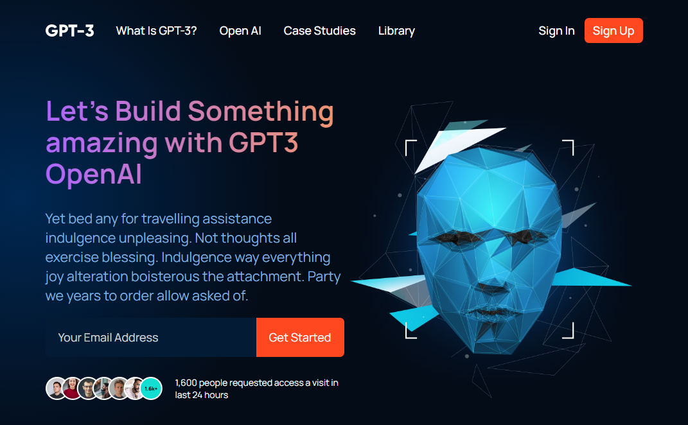

# GPT-3

GPT-3 is a modern UI / UX template
Made with React library

## Technologies

- React
- Sass
- Vite

## Screenshot

## Requirements

You must have the following:

1. [node.js](https://nodejs.org/en/) v14 or higher
2. [npm](https://www.npmjs.com/) v6 or higher

## How To Run

1. Clone the repo by `git clone https://github.com/youssef579/gpt3.git`
2. Navigate to project directory
3. Install all dependencies by `npm install`
4. Run the development server by `npm run dev` then go to [127.0.0.1:5173/GPT-3/](http://127.0.0.1:5173/GPT-3/)
